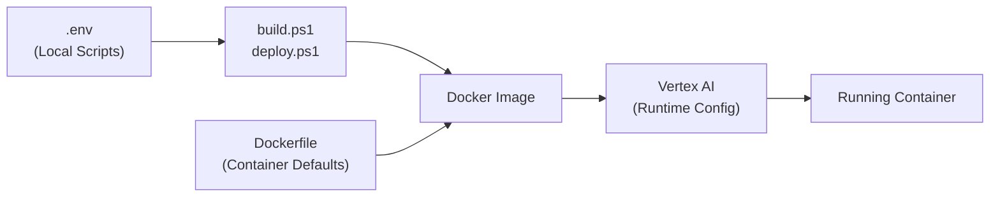

# Configuration Guide

## Environment Variables Architecture

This project uses a **three-level environment variable system** to separate concerns between local development, container defaults, and production deployment.



### Level 1: Local Scripts (`.env`)

**Purpose:** Configure build and deployment scripts  
**Location:** `d:\Programming\Aru\dog\open-sora-serving-gcp\.env`  
**Used by:** PowerShell scripts (`build.ps1`, `deploy.ps1`, `myconfig.ps1`)  
**Not copied to container**

```bash
# GCP Project Configuration
PROJECT_ID=nannieai-website-stealth
REGION=europe-west4
REPOSITORY=opensora-serving-api
IMAGE_NAME=opensora-api
TAG=v1.0.3

# Deployment Configuration
MACHINE_TYPE=a2-ultragpu-1g
ACCELERATOR_TYPE=nvidia-a100-80gb
ACCELERATOR_COUNT=1
```

!!! warning "Local Only"
    These variables are **never** copied into the Docker container. They only control how the scripts build and deploy the service.

### Level 2: Container Defaults (Dockerfile)

**Purpose:** Baked-in defaults for the containerized application  
**Location:** `service/Dockerfile`  
**Used when:** Container starts without runtime overrides  
**Can be overridden:** Yes, via runtime environment variables

```dockerfile
ENV DEFAULT_RESOLUTION=256px \
    DEFAULT_NUM_FRAMES=49 \
    DEFAULT_ASPECT_RATIO=16:9 \
    DEFAULT_MODE=t2i2v \
    DEFAULT_FPS=24 \
    DEFAULT_NUM_SAMPLES=1 \
    DEFAULT_MOTION_SCORE=4 \
    DEFAULT_NUM_STEPS=50
```

!!! info "Sensible Defaults"
    These defaults provide a working configuration out-of-the-box. Override them at runtime for different environments (dev/staging/prod).

### Level 3: Runtime Configuration

**Purpose:** Production deployment settings and secrets  
**Passed via:**
- Vertex AI deployment environment variables
- `docker run -e VARIABLE=value`
- Kubernetes ConfigMap/Secret
- Cloud Run environment variables

**Overrides:** Dockerfile defaults

```bash
# Critical runtime variables
WEIGHT_BUCKET=my-weights-bucket  # REQUIRED
OUTPUT_BUCKET=my-output-bucket   # REQUIRED

# Optional overrides
DEFAULT_RESOLUTION=768px
GENERATION_TIMEOUT=3600
```

!!! danger "Required Variables"
    `WEIGHT_BUCKET` must be set at runtime. It's intentionally left empty in the Dockerfile to prevent hardcoding credentials.

---

## Variable Reference

### GCP/Deployment (Local `.env` only)

| Variable | Description | Example |
|----------|-------------|---------|
| `PROJECT_ID` | GCP project ID | `nannieai-website-stealth` |
| `REGION` | Deployment region | `europe-west4` |
| `REPOSITORY` | Artifact Registry repository | `opensora-serving-api` |
| `IMAGE_NAME` | Docker image name | `opensora-api` |
| `TAG` | Image version tag | `v1.0.3` |
| `MACHINE_TYPE` | Vertex AI machine type | `a2-ultragpu-1g` |
| `ACCELERATOR_TYPE` | GPU type | `nvidia-a100-80gb` |
| `ACCELERATOR_COUNT` | Number of GPUs | `1` |

### Model Weights (Runtime)

| Variable | Required | Default | Description |
|----------|----------|---------|-------------|
| `WEIGHT_BUCKET` | **Yes** | *(empty)* | GCS bucket containing model weights |
| `WEIGHT_PREFIX` | No | `ckpts/` | Path prefix within bucket |
| `MODEL_PATH` | No | `/app/ckpts` | Local mount path for weights |
| `FORCE_DOWNLOAD` | No | `false` | Force re-download of weights |

### API Server (Runtime)

| Variable | Required | Default | Description |
|----------|----------|---------|-------------|
| `PORT` | No | `8080` | HTTP server port |
| `OUTPUT_BUCKET` | **Yes** | *(none)* | GCS bucket for generated videos |

### Job Manager (Runtime)

| Variable | Required | Default | Description |
|----------|----------|---------|-------------|
| `JOB_RETENTION_SECONDS` | No | `3600` | How long to keep completed jobs (1 hour) |
| `MAX_COMPLETED_JOBS` | No | `100` | Maximum completed jobs in memory |

### Video Generation Defaults (Runtime)

#### API Request Level

| Variable | Default | Options | Description |
|----------|---------|---------|-------------|
| `DEFAULT_RESOLUTION` | `256px` | `256px`, `768px` | Video resolution |
| `DEFAULT_NUM_FRAMES` | `49` | 17, 33, 49, 65, 81, 97, 113, 129 | Frame count (4k+1 format) |
| `DEFAULT_ASPECT_RATIO` | `16:9` | `16:9`, `9:16`, `1:1`, `2.39:1` | Aspect ratio |
| `DEFAULT_MODE` | `t2i2v` | `t2v`, `t2i2v` | Generation mode |
| `DEFAULT_FPS` | `24` | Any positive integer | Frames per second |
| `DEFAULT_NUM_SAMPLES` | `1` | Any positive integer | Number of videos to generate |

#### Runner Level

| Variable | Default | Description |
|----------|---------|-------------|
| `DEFAULT_MOTION_SCORE` | `4` | Motion intensity (1-10, recommend 5-7) |
| `DEFAULT_NUM_STEPS` | `50` | Diffusion sampling steps |
| `DEFAULT_GUIDANCE` | *(from config)* | Guidance scale (typically 7.5) |
| `DEFAULT_TIMEOUT_SECONDS` | `1800` | Per-job timeout (30 minutes) |
| `GENERATION_TIMEOUT` | `1800` | Worker timeout (30 minutes) |
| `BASE_OUTPUT_DIR` | `/tmp/opensora_outputs` | Temporary output directory |

---

## Setup Instructions

### 1. Local Development Setup

```powershell
# Copy the template
Copy-Item .env.example .env

# Edit .env with your GCP project settings
notepad .env

# Load configuration
cd scripts
. .\myconfig.ps1
```

**Edit `.env`:**
```bash
PROJECT_ID=your-project-id
REGION=your-region
REPOSITORY=your-artifact-registry-repo
IMAGE_NAME=opensora-api
TAG=v1.0.0

MACHINE_TYPE=a2-ultragpu-1g
ACCELERATOR_TYPE=nvidia-a100-80gb
```

### 2. Docker Local Testing

```bash
docker run --gpus all -p 8080:8080 \
  -e WEIGHT_BUCKET=my-weights-bucket \
  -e OUTPUT_BUCKET=my-output-bucket \
  -e DEFAULT_RESOLUTION=768px \
  -e GENERATION_TIMEOUT=3600 \
  opensora-api:latest
```

### 3. Vertex AI Deployment

Environment variables are passed in the deployment configuration:

```powershell
# Option 1: Using deploy script (reads from .env)
. .\deploy.ps1

# Option 2: Manual deployment with custom env vars
gcloud ai endpoints deploy-model $ENDPOINT_ID `
  --region=$REGION `
  --model=$MODEL_ID `
  --env-vars="WEIGHT_BUCKET=my-weights-bucket,OUTPUT_BUCKET=my-output-bucket,DEFAULT_RESOLUTION=768px"
```

---

## Common Scenarios

### Changing Default Resolution

**For development:**
```dockerfile
# Edit service/Dockerfile
ENV DEFAULT_RESOLUTION=768px
```

**For production:**
```bash
# Set at deployment time
-e DEFAULT_RESOLUTION=768px
```

### Using Different Weight Buckets

**Development:**
```bash
docker run -e WEIGHT_BUCKET=dev-weights-bucket ...
```

**Staging:**
```bash
docker run -e WEIGHT_BUCKET=staging-weights-bucket ...
```

**Production:**
```bash
docker run -e WEIGHT_BUCKET=prod-weights-bucket ...
```

### Increasing Timeouts for 768px Generation

```bash
# 768px videos take longer to generate
docker run \
  -e GENERATION_TIMEOUT=3600 \
  -e DEFAULT_TIMEOUT_SECONDS=3600 \
  -e DEFAULT_RESOLUTION=768px \
  ...
```

---

## Best Practices

### Security

!!! danger "Never Commit Secrets"
    - **Never** commit `.env` to version control
    - Use `.env.example` as a template only
    - Set `WEIGHT_BUCKET` at runtime, not in Dockerfile
    - Use GCP Secret Manager for sensitive values in production

### Configuration Management

!!! tip "Separation of Concerns"
    - **Local `.env`**: Build/deploy tool settings only
    - **Dockerfile**: Sensible defaults for any environment
    - **Runtime**: Environment-specific overrides and secrets

### Deployment Strategy

1. **Development**: Use Dockerfile defaults, override with `docker run -e`
2. **Staging**: Override critical variables (buckets, timeouts)
3. **Production**: Full runtime configuration via Vertex AI

### Version Control

```bash
# Tracked files
✓ .env.example       # Template with documentation
✓ Dockerfile         # Container defaults
✓ ENV_VARS.md        # This guide

# Ignored files
✗ .env               # Local configuration (in .gitignore)
```

---

## Troubleshooting

### "WEIGHT_BUCKET not set" Error

**Cause:** Runtime environment variable missing  
**Fix:** Pass via `docker run -e WEIGHT_BUCKET=...` or Vertex AI config

### "Permission denied" on GCS Upload

**Cause:** Service account lacks Storage Object Creator role  
**Fix:** 
```bash
gcloud projects add-iam-policy-binding $PROJECT_ID \
  --member="serviceAccount:$SERVICE_ACCOUNT" \
  --role="roles/storage.objectCreator"
```

### Changes to `.env` Not Taking Effect

**Cause:** Variables not reloaded  
**Fix:**
```powershell
# Reload in current session
. .\myconfig.ps1

# Or restart PowerShell
```

### Dockerfile ENV Changes Not Applying

**Cause:** Docker image not rebuilt  
**Fix:**
```powershell
cd scripts
. .\build.ps1  # Rebuild and push image
```

### Different Behavior Between Local and Production

**Cause:** Missing runtime environment variables  
**Fix:** Compare environments:
```bash
# Local
docker inspect <container_id> | grep -A 20 "Env"

# Production (Vertex AI)
gcloud ai models describe $MODEL_ID --region=$REGION
```

---

## Quick Reference

| Variable | Local `.env` | Dockerfile | Runtime | Priority |
|----------|--------------|------------|---------|----------|
| `PROJECT_ID` | ✓ | ✗ | ✗ | Script-only |
| `WEIGHT_BUCKET` | ✗ | ✗ (empty) | **Required** | Runtime |
| `OUTPUT_BUCKET` | ✗ | ✗ | **Required** | Runtime |
| `DEFAULT_RESOLUTION` | ✗ | ✓ (`256px`) | Optional | Runtime > Dockerfile |
| `GENERATION_TIMEOUT` | ✗ | ✓ (`1800`) | Optional | Runtime > Dockerfile |

**Priority Order:** Runtime Environment Variables > Dockerfile ENV > Application Defaults

---

## Additional Resources

- [Deployment Guide](deployment_guide.md) - Full Vertex AI deployment
- [Local Running](local_running.md) - Development environment setup
- [Architecture](architecture.md) - System design overview
- [Code Reference](code_reference.md) - API and module documentation
