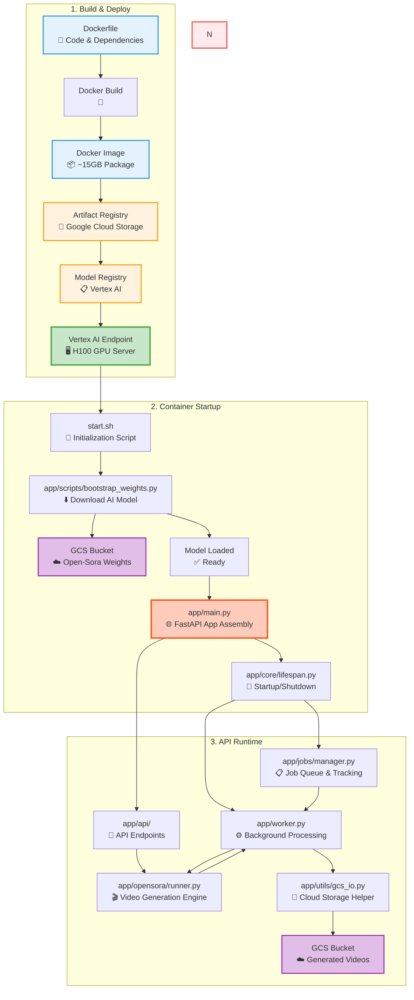

# Open-Sora API

Source code: [Github - open-sora-serving-gcp](https://github.com/Raghav-56/open-sora-serving-gcp)

## System Overview

The Open-Sora API is a **production-ready video generation service** designed for deployment on Google Cloud Vertex AI. It provides an HTTP API for text-to-video generation using the Open-Sora model.

### Key Features

- **Async Job Queue**: Handles multiple requests without blocking
- **GCS Integration**: Automatically uploads generated videos to Google Cloud Storage
- **Robust Error Handling**: Comprehensive logging and failure recovery, checks for video existence even on non-zero exit codes
- **Vertex AI Compatible**: Meets all Vertex AI deployment requirements
- **Multi-Resolution Support**: 256px and 768px resolutions
- **Optimized Single-GPU Mode**: Custom configurations with torchrun for stable distributed initialization
- **Hardware Compatibility**: Uses PyTorch SDPA attention backend for broad GPU compatibility

### Technology Stack

- **Framework**: FastAPI (Python web framework)
- **ML Model**: Open-Sora v2 (HPC-AI Tech's text-to-video model)
- **GPU**: NVIDIA H100/A100 with CUDA 12.1
- **Storage**: Google Cloud Storage (GCS)
- **Container**: Docker
- **Deployment**: Google Cloud Vertex AI

## Ops & Helpers

This repo includes a set of PowerShell helper scripts under the `scripts/` directory to make builds, deploys and testing easier. See the `Scripts` page for details: `scripts.md`.

There is also an experimental web frontend for demo and testing purposes under `frontend/` — see `frontend/README.md` for details; this UI is in active development and not production-ready.

## Architecture Overview

## Technical Assets on Google Cloud Platform

### Required Resources:

- Open-Sora Weight Bucket: Cloud storage `nannie-opensora-weights` (**DO NOT DELETE**)
- Artifact Registry: `opensora-serving-api`
- Model Registry: `opensora-video-v1.0.0`
- Vertex AI Endpoint: `opensora-video-endpoint`
- Service Account: `ml-model-serving@nannieai-website-stealth.iam.gserviceaccount.com` (**DO NOT DELETE**)

### For development only:
- Bucket for videos generated during testing: Cloud storage `ml-video-serving-test-results-us1`

## Model Information

- **Model**: Open-Sora v2 (11B parameters) from HPC-AI Tech
- **Hugging Face**: [hpcai-tech/Open-Sora-v2](https://huggingface.co/hpcai-tech/Open-Sora-v2)
- **GitHub**: [hpcaitech/Open-Sora](https://github.com/hpcaitech/Open-Sora)
- **Default Mode**: t2v_single_gpu (optimized single GPU with custom configs)
- **Supported Modes**: 
  - `t2v_single_gpu`: Single GPU optimized (shardformer disabled, torchrun with --standalone)
  - `t2v`: Direct text-to-video
  - `t2i2v`: Text-to-image-to-video pipeline using Flux
- **Supported Resolutions**: 256px (fast), 768px (high quality)
- **Frame Counts**: 4k+1 format (17, 33, 49, 65, 81, 97, 113, 129)
- **Aspect Ratios**: 16:9, 9:16, 1:1, 2.39:1
